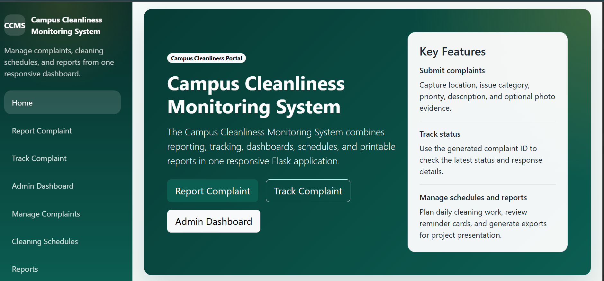
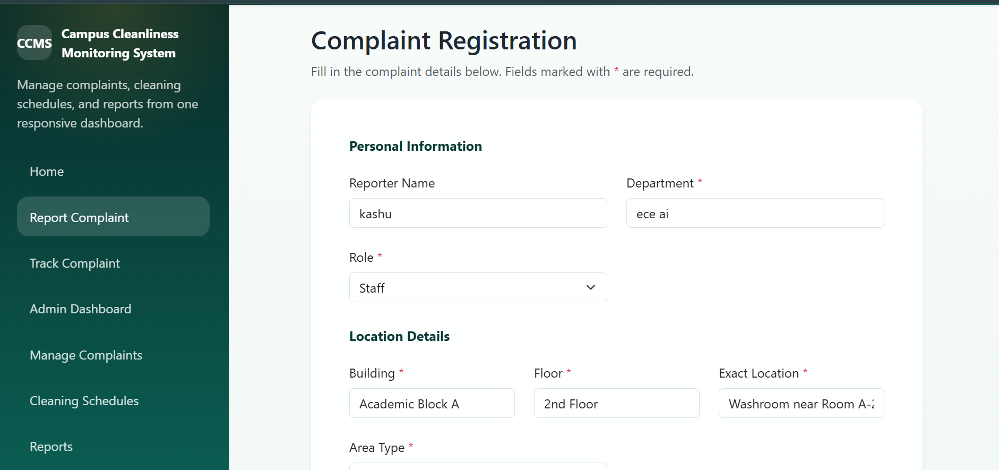
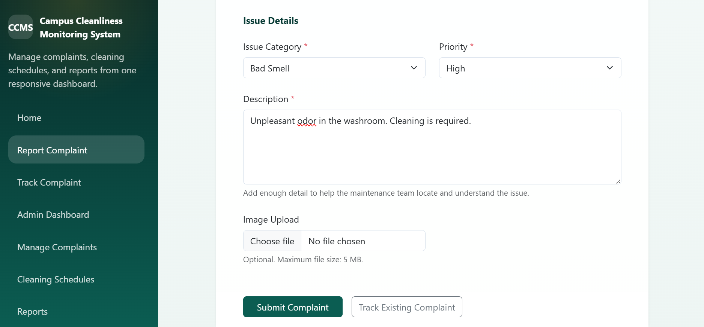
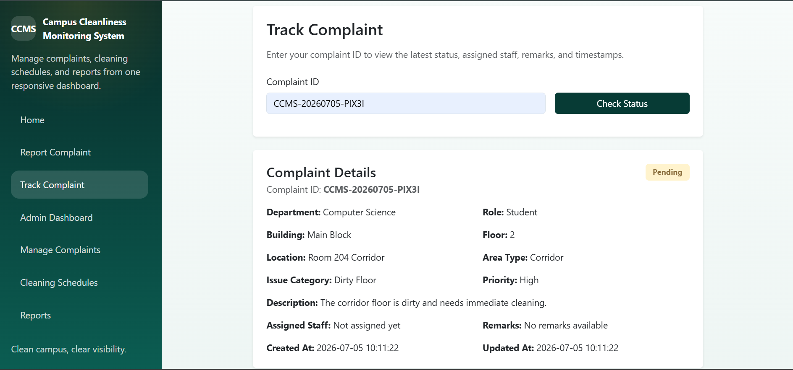
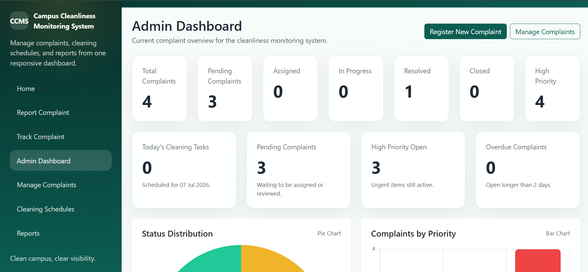
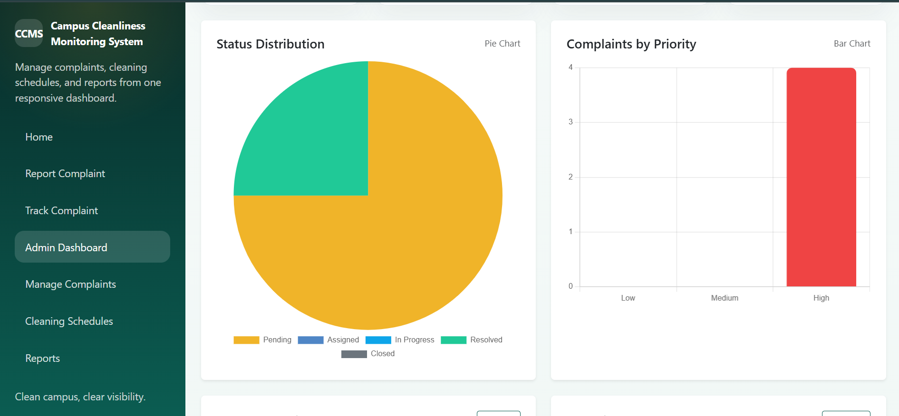
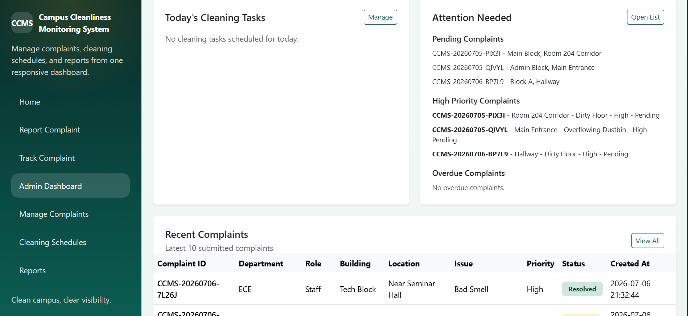
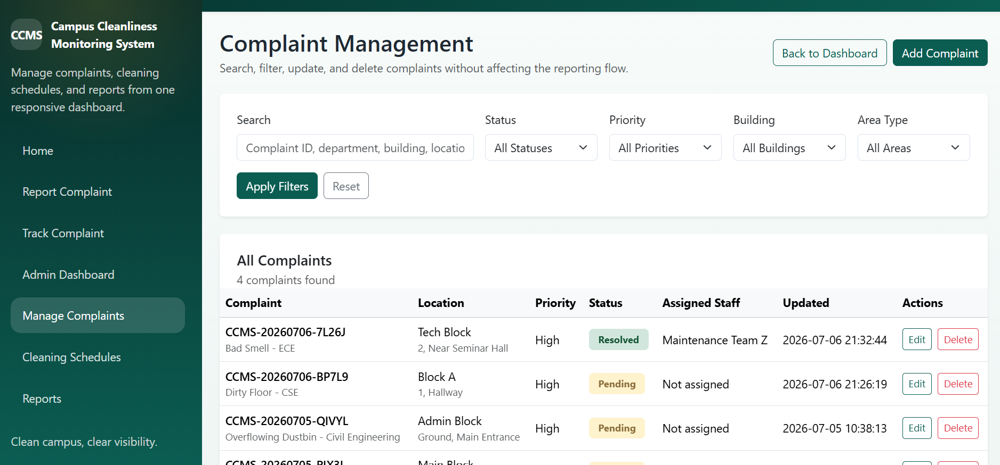
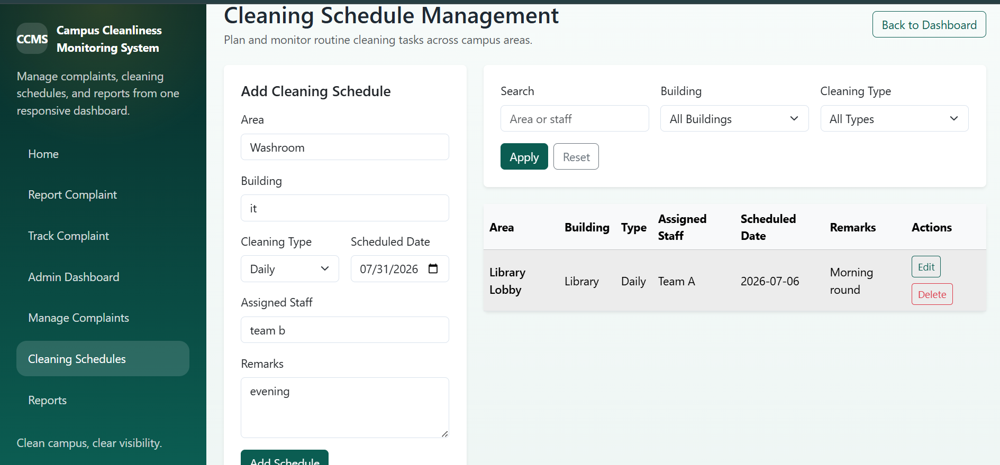
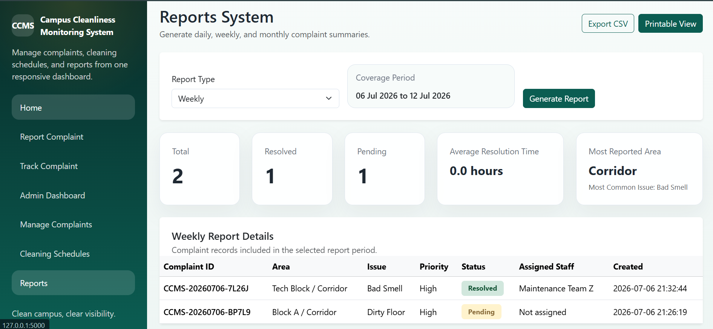

# Campus Cleanliness Monitoring System

A Flask-based web application for reporting, tracking, and managing campus cleanliness issues.

## Overview

The Campus Cleanliness Monitoring System is a mini project developed to improve how cleanliness-related complaints are recorded and monitored within a college campus. It provides a simple digital workflow for students, faculty, staff, and administrators to report issues, track complaint progress, manage cleaning schedules, and review summary reports through a centralized web interface.

## Problem Statement

In many institutions, campus cleanliness issues such as dirty floors, overflowing dustbins, blocked washrooms, and bad odors are often reported informally, which leads to delays, poor tracking, and limited accountability. This project addresses that problem by offering a structured complaint management system with status tracking, administrative control, cleaning schedule management, and reporting support.

## Features

- Submit campus cleanliness complaints with location details, priority, description, and optional image upload
- Auto-generate a unique complaint ID for every complaint
- Track complaints using the complaint ID
- View complaint status, assigned staff, remarks, created date, and updated date
- Manage complaints through an admin dashboard
- Search, filter, update, and delete complaints
- View complaint summaries with dashboard cards and charts
- Manage daily, weekly, and monthly cleaning schedules
- View dashboard reminder sections for pending, overdue, and high-priority complaints
- Generate daily, weekly, and monthly reports
- Export reports as CSV
- Open a printable report page
- Responsive Bootstrap-based user interface with sidebar navigation, toast notifications, and loading spinner

## Tools & Technologies

- Python
- Flask
- SQLite
- HTML
- CSS
- JavaScript
- Bootstrap 5
- Jinja2

## Project Structure

```text
## Project Structure

```text
Campus Cleanliness System/
├── app.py
├── database.db
├── requirements.txt
├── README.md
├── templates/
│   ├── admin_dashboard.html
│   ├── base.html
│   ├── index.html
│   ├── manage_complaints.html
│   ├── manage_schedules.html
│   ├── print_report.html
│   ├── report_complaint.html
│   ├── reports.html
│   └── track_complaint.html
├── static/
│   ├── css/
│   │   └── style.css
│   ├── js/
│   │   └── main.js
│   └── uploads/   //# Stores uploaded complaint images
└── screenshot/
    ├── home.png
    ├── report.png
    ├── report2.png
    ├── track.png
    ├── dashboard.png
    ├── dashboard2.png
    ├── dashboard3.png
    ├── manage_complaints.png
    ├── schedule.png
    └── reports.png
```

## Workflow / System Architecture

1. A user submits a cleanliness complaint through the complaint registration form.
2. The system validates the input, stores the complaint in SQLite, and generates a unique complaint ID.
3. Users can track complaint progress using the complaint ID.
4. Admin users monitor complaints through the dashboard and complaint management pages.
5. Admin users can update status, assign staff, add remarks, and resolve complaints.
6. Cleaning schedules are created and managed separately for campus maintenance planning.
7. Reports are generated from stored complaint records for daily, weekly, and monthly review.

## Installation & Setup

1. Clone or download the project folder.
2. Open the project directory in your terminal.
3. Create a virtual environment:

```powershell
python -m venv .venv
```

4. Activate the virtual environment:

```powershell
.\.venv\Scripts\Activate.ps1
```

5. Install the required packages:

```powershell
pip install -r requirements.txt
```

## How to Run

1. Start the Flask application:

```powershell
python app.py
```

2. Open the following URL in your browser:

```text
http://127.0.0.1:5000
```

## Results & Conclusion

The project successfully provides a complete web-based cleanliness monitoring system for a college campus. It supports complaint registration, complaint tracking, admin-side management, cleaning schedule planning, and report generation in a single application. This makes complaint handling more organized, transparent, and easy to monitor compared to manual reporting methods.


## Screenshots

### Home Page



### Report Complaint



### Complaint Form (Continued)



### Complaint Tracking



### Admin Dashboard



### Dashboard Analytics



### Dashboard Reminders



### Manage Complaints



### Cleaning Schedule



### Reports




## Future Enhancements

- Add user authentication for separate student and admin access
- Introduce email or SMS reminders for assigned staff
- Add complaint history analytics and trend-based reporting
- Provide downloadable PDF reports
- Add department-wise or building-wise dashboard breakdowns

## Author

**Kashish kumari**
B.Tech Computer Science Engineering with Artificial intelligence student
GitHub: https://github.com/Kashish1924


## License

This project is developed for academic and educational purposes.
